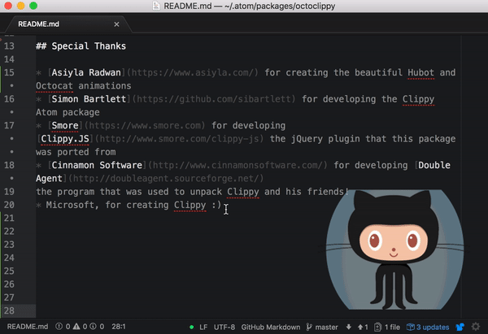
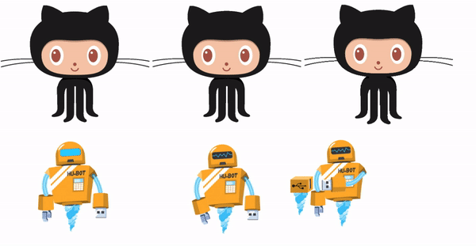

# OctoClippy 🐙📎

This Atom package adds Octocat and Hubot to the [Atom](http://atom.io) package [Clippy](https://github.com/npentrel/octoclippy) (and friends) .

## Instructions

After installing the package click on the Packages rider in the top menu and, under OctoClippy, select the agent you want to see.

## The animations

## Special Thanks

* [Asiyla Radwan](https://www.asiyla.com/) for creating the beautiful Hubot and Octocat animations
* [Simon Bartlett](https://github.com/sibartlett) for developing the Clippy Atom package
* [Smore](https://www.smore.com) for developing [Clippy.JS](http://www.smore.com/clippy-js) the jQuery plugin that this package was ported from
* [Cinnamon Software](http://www.cinnamonsoftware.com/) for developing [Double Agent](http://doubleagent.sourceforge.net/)
the program that was used to unpack Clippy and his friends!
* Microsoft, for creating Clippy :)

## Installing this package from [GitHub](https://github.com/npentrel/octoclippy)
1. Install package by git cloning this package into `/Users/(Name)/.atom/packages/`.
2. Run `npm install`.
4. Open Atom.
5. In Atom's menu navigate to `OctoClippy` and select your favorite agent!
